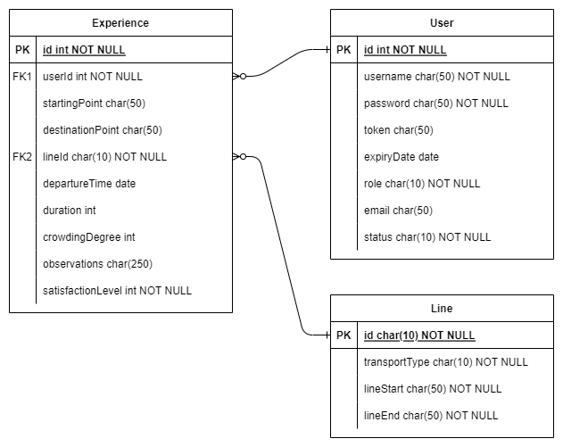

### tw-transport-feedback

# Aplicație web pentru partajarea experiențelor utilizării mijloacelor de transport

# Cerințe

## Obiectiv

Realizarea unei aplicații web prin care utilizatorii pot împărtăși experiența din urma utilizării unuia din mijloacele de transport în comun.

## Descriere

Aplicația trebuie să permită crearea unui cont prin care utilizatorul poate să partajeze o experiență, după ce a folosit un mijloc de transport în comun. Pentru utilizatorii anonimi, aplicația va permite căutarea și vizualizarea intrărilor în platformă.

## Funcționalități (minime)

### Modulul Utilizator

-   Creare cont utilizator pe baza unor câmpuri sau cu ajutorul unui API extern (GMAIL, Facebook, Linkedin)
-   Modificarea sau dezactivarea contului    
-   Resetarea parolei

### Modulul de Partajare

-   Crearea unei experiențe presupune completarea următoarelor câmpuri:
    -   Punctul de plecare (A)
    -   Punctul de sosire (B)
    -   Mijlocul de transport folosit: bus, metro, tram, etc.
    -   Ora plecare
    -   Durata călătoriei
    -   Gradul de aglomerare al mijlocului de transport
    -   Observații
    -   Nivelul de satisfacție (smiley faces)
-   Modificarea intrărilor specifice utilizatorului
-   Listarea tuturor experiențelor create de un utilizator
-   Ștergerea unei experiențe

### Modulul de Căutare

-   Modulul de căutare va trebui să permită utilizatorului introducerea unor cuvinte cheie, după care vor fi afișate rezultatele, sub formă de listă.
-   Modulul va trebui să returneze rezultate relevante în funcție de locație, mijlocul de transport folosit sau destinație


# Descriere soluție

Aplicația constă într-un back-end RESTful care accesează date stocate într-o bază relațională pe baza unui API de persistenţă și date expuse de un serviciu extern și frontend SPA (Single Page Application) realizat cu React.

- Back-end-ul implementează o interfață **REST** și este realizat în **node.js**
- Stocarea se face într-o bază relațională **SQLite** accesată prin intermediul unui ORM - **sequelize**
- Front-end-ul este realizat cu **React.js**, front-end framework bazat pe componente
- Securitate web - se va implementa un mecanism de autentificare și autorizare cu mai multe nivele de acces:
	- utilizator anonim (neautentificat) - sunt permise doar căutări și vizualizări
	- utilizator autentificat - este permisă introducerea de feedback
	- administrator aplicație - gestiune date de referință, ca de exemplu adăugarea de linii de transport noi


# Structura bazei de date

Datele vor fi stocate într-o bază de date relațională cu diagrama ERD de mai jos.



# Entități

Sunt definite următoarele entități:

---
**Experience** - conține datele aferente unei experiențe:
- **id**: cheia primară, numerică, autoincrement
- **userId**: referință id utilizator - cheie straină entitate **User**
- **startingPoint**: denumirea punctului de plecare, de ex. Eroilor
- **destinationPoint**: denumirea punctului de destinație, de ex. Piața Romană
- **lineId**: referință linie de transport - cheie străină entitate **Line**. Id-ul de linie este cheie naturală, de ex. 381 sau M1, etc.
- **departureTime**: data și ora plecării, de exemplu: "2022-11-21 14:35"
- **duration**: durata călătoriei exprimată în minute (având în vedere că în mod uzual nu se cronometrează la secundă)
- **crowdingDegree**: gradul de aglomerare exprimat ca procent cu valori între 0 și 100
- **observations**: text editabil în care utilizatorul descrie experiența
- **satisfactionLevel**: câmp obligatoriu - valoare numerică între 1 și 5 care va fi reprezentată prin niște steluțe colorate corespunzător alegerii

---
**User** - datele aferente unui utilizator:
- **id**: cheia primară, numerică, auto-increment
- **username**: login ales de utilizator, de exemplu nume.prenume. Nu poate fi duplicat
- **password**: parola. Va fi salvată parola criptată.
- **token**: pentru un utilizator care a reușit login-ul acest câmp va conține token-ul generat de backend
- **expiryDate**: dată și ora de expirare conectare, după care este necesar un nou login
- **role**: rolul utilizator, cu valori posibile:
	- Anonim
	- User
	- Admin
- **email**: adresa de email a utilizatorului. Se validează formatul de adresă de email.
- **status**: stare cont utilizator. Este un enum cu următoarele valori posibile:
	- **Creat** - o confirmare poate fi necesară pentru activare (de către administrator sau confirmare prin link transmis via email, dacă un server de email este disponibil)
	- **Activ** - un utilizator care poate înregistra o experiență
	- **Inactiv** - cont dezactivat de către administrator sau de către utilizator (unsubscribe)

---
**Line** - datele aferente unei linii de transport:
- **id** - identificator linie de transport. Este un câmp alfanumeric, fiind permise atât valori numerice (de ex. 41, 381) cât și alfanumerice (de ex. N118, M1, M2)
- **transportType**: este un enum cu valorile: 
	- Autobuz
	- Tramvai
	- Troleibuz
	- Metrou
- **lineStart**: stația capăt de linie de pornire
- **lineEnd**: stația finală a liniei de transport


# API-uri REST

În continuare sunt prezentate metodele expuse de backend pentru fiecare entitate (User, Experience, Line), parametrii de request și un exemplu de response.

### User

- `GET /users` - răspunde cu lista tuturor utilizatorilor
- `GET /users/:uid` - răspunde cu utilizatorul cu id-ul uid
- `POST /users` - adaugă un utilizator nou
- `PUT /users/:uid` - modifică utilizatorul cu id-ul uid
- `DELETE /users/:uid` - șterge (dezactivează) utilizatorul cu id-ul uid

### Experience

- `GET /experiences` - răspunde cu lista tuturor experiențelor
- `GET /experiences/:eid` - răspunde cu experiența cu id-ul eid
- `POST /experiences` - adaugă o nouă experiență
- `PUT /experiences/:eid` - modifică o experiență cu id-ul eid
- `DELETE /experiences/:eid` - șterge experiența cu id-ul eid

### Line

- `GET /lines` - răspunde cu lista tuturor liniilor
- `GET /lines/:lid` - răspunde cu linia cu id-ul lid
- `POST /lines` - adaugă o nouă linie
- `PUT /lines/:lid` - modifică o linie cu id-ul lid
- `DELETE /lines/:lid` - șterge linia cu id-ul lid


### Interogări pentru căutare

- `GET /lines/:lid/experiences` - răspunde cu lista tuturor experiențelor care aparțin liniei cu id-ul lid
- `GET /users/:uid/experiences` - răspunde cu lista tuturor experiențelor care aparțin utilizatorului cu id-ul uid

Exemplu request pentru `GET /lines`:
```
GET /lines?transportType=Metrou&orderBy=id
```

Exemplu response:
```json
[ 
  {
    "id": "M1",
    "transport_type": "Metrou",
    "line_start": "Dristor",
    "line_end": "Pantelimon"
  },
  {
    "id": "M2",
    "transport_type": "Metrou",
    "line_start": "Berceni",
    "line_end": "Pipera"
  }
]
```


# Interfață utilizator

În continuare este prezentat un mock-up pentru interfața utilizator a aplicației în ipoteza în care utilizatorul este conectat și este în curs adăugarea unei experiențe.


În funcție de tipul de utilizator, unele dintre opțiunile din pagină vor fi ascunse.
1. Un utilizator cu rol de **administrator** (role=Admin) va avea drepturi pentru a gestiona toate cele 3 tipuri de entități:
	- Experiențe
	- Linii
	- Utilizatori
2. Un **utilizator autentificat** (role=User) va avea dreptul de a gestiona experiențele proprii, dar și de a vizualiza experiențele postate de ceilalți utilizatori. De asemenea va putea vizualiza informațiile privind liniile de transport.
3. Un **utilizator neautentificat** va avea doar drepturi de vizualizare pentru experiențele adăugate de alți utilizatori și pentru informațiile privind liniile de transport. 

Mai jos este prezentat un mock-up pentru interfața utilizator a aplicației în ipoteza în care utilizatorul cu rol de administrator este conectat și este în curs adăugarea unei linii de transport.


Mai jos este prezentat un mock-up pentru interfața utilizator a aplicației în ipoteza în care utilizatorul cu rol de administrator este conectat și se află în pagina de gestiune utilizatori.


# Plan proiect

În continuare este prezentată planificarea proiectului pentru perioada noiembrie - ianuarie, cu sarcinile de lucru pentru cei trei membri ai echipei.


